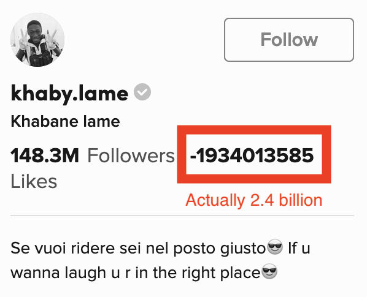

# Introduction 

TikTok is a popular social media platform, with its success often attributed to
the proprietary algorithm it uses to choose what content to display to which
users. The content entirely consists of short, vertical-format videos (called
TikToks) which are presented to the user sequentially.

The algorithm presents videos to a user, and learns what they like based on how
long a user watches a particular video and how they interact with it. Often
certain audio clips can go viral, being used in many different TikToks by many
different creators.

This project does not attempt to analyse the audio or video content of the
TikToks, but rather analyses the numerical quantities associated with the
TikToks. The goal is to explore trends and attempt to find instances where a
particular audio, TikTok, or creator went viral.

It was found that TikTok has an integer overflow error for its top 2 creators
who have over $2^{31}$ likes on their profile (@khaby.lame and @bellapoarch)
which resulted in negative and malformatted likes appearing in their profile
previews.

Many TikToks were found that went viral, accumulating millions of likes in
less than a week. These viral videos were correlated ($r=TODO$) with the creator 
gaining hundreds of thousands of followers in the same time period.

Often the ratio of likes to comments on a video were similar for a given
creator, implying creators induce a consistent impulse on their viewers to like
or comment, and that this impulse does not change as the video becomes more
popular.

# Implementation

A scraper for TikTok was written using the python libraries `scrapy`,
`selenium`, and `requests` TODO: links?. It made use of a single spider
`tiktok_spider.py`, and a single `TikTok` item. A pipeline was used to parse
any poorly formatted values into numbers and to ensure the resulting data was
clean.

This crawler was run every hour via a cron job that executed the script
`tiktok_scraper.cron`. The data is saved to `tiktoks.jsonlines`
and then copied via `scp` to the author's machine for analysis.

# Crawl process

This scraper loads the home page of TikTok `https://www.tiktok.com/foryou` and
scrolls through videos until data from 100 unique videos have been recorded.
These data are then saved to disc for later analysis. Each run of the scraper
takes about 50 minutes, and is initiated at the start of each hour. If the
previous job is still running when the next job starts, the previous job is
killed.

The scraper does not log in to the TikTok website, so the scraper is shown
whatever content the website would show to an anonymous user every time the
scraper starts up. This has the advantage that every scraping run is as similar
as possible, but the disadvantage that the ability of the TikTok algorithm to
tailor videos to a user's interests cannot be analysed. This project can be
seen as a broad analysis of the TikTok algorithm.

TikTok has several mechanisms to deter automated scrapers. Selenium is required
as TikTok only presents two videos when the home page is initially loaded, and
if JavaScript is disabled then nearly the entire content of the website is
immediately deleted and an error message is shown to the user.

To avoid these, a non-default view of the website is navigated to via Selenium.
This non-default view does not include some of the Captchas, and by using
Selenium for full browser automation, TikToks can be loaded as the crawler
scrapes the website.

# Data scraped

For each TikTok, the following values were scraped:

- `scraped_at`: The timestamp at which the item was scraped.
- `url`: The URL for the TikTok.
- `audio`: The name of the audio associated with the TikTok.
- `audio_url`: The URL source of that audio.
- `likes`: The number of likes on the TikTok.: The
- `comments`: The number of comments on the TikTok.
- `username`: The url of the creator.
- `user_followers`: The number of followers the creator had at the time of
  scraping.
- `user_likes`: The number of likes the creator had at the time of scraping.

Note that TikTok does not show the fully accurate number of likes and comments.
Instead, a summary like $12.3K$ or $45.6M$ is shown. These instances were
parsed to complete numbers like $12 300$ or $45 600 000$. This has the effect
that the resolution of the values is dependant on the magnitude of those
values; a change of 5000 is visible if that change is from 5000 to 10000, but
it not made visible if the change is from 1000000 to 1 005 000. This will cause
problems in the interpretation of results, as videos which increase in the
number of likes or comments at a constant rate will appear to stagnate as the
absolute number of likes or comments increases.

The resulting dataset contains 20 500 observations taken over the 13 day time
period 2022-07-30 to 2022-08-11. There are 1700 unique TikToks, 1400 unique
audio clips, and 1400 unique creators. TODO update these numbers.

# Results

## Finding Viral Videos

There is no standardised academic definition for a 'viral' video or piece of
content. For the purposes of this project, a viral video is one which
outperforms a significant percent of other videos on the platform in terms of
attention per unit time. Attention per unit time can be defined as likes per
hour, likes per day, or some other rate metric.

Note that this definition intentionally does not account for how popular
creators with millions of followers will more easily create viral content than
smaller creators with less than several thousand followers. Including the
number of followers in the definition of a viral video could cause a cyclical
dependency issue: a viral video could increase the number of followers the
creator has, which could cause the video to no longer meet the definition of
virality.

Figure \ref{fig:placeholder} shows a placeholder.

\begin{figure}
    \centering
    \includegraphics[width=0.5\textwidth]{img/tmp.png}
    \caption{Placeholder caption}
    \label{fig:placeholder}
\end{figure}

## Finding Viral Audios

## Finding Viral Creators

## Correlation between posting frequency and Follower growth

## Correlation between posting frequency and Likes

(answers to questions)

# Questions

General:
    - Number of unique creators
    - Number of unique audios
    - Number of unique tiktoks
    - Number of scraping instances

Per creator:
    - Most followed creator over time
    - Creators with the greatest increase in follower count
    - Creators with the most tiktoks
    - Creators with the highest likes per tiktok
    - Creators with the highest likes per follower
    - Most prolific creator

Per audio:
    - Number of unique tiktok-audio combinations over time

Per tiktok:
    - Number of likes over time
    - Number of comments over time
    - Number of shares over time

# Bibliography

::: {#refs}
:::

# Figures

\begin{figure}
    \centering
    \includegraphics[width=0.5\textwidth]{img/khaby.lame.png}
    \includegraphics[width=0.5\textwidth]{img/bellapoarch.png}
    \caption{\texttt{@khaby.lame}'s and \texttt{@bellapoarch}'s profile
    previews show negative likes, indicative of an integer overflow}
\end{figure}
